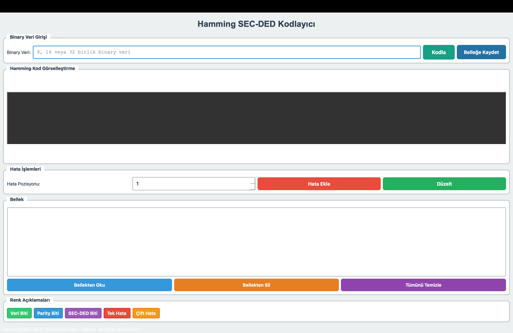
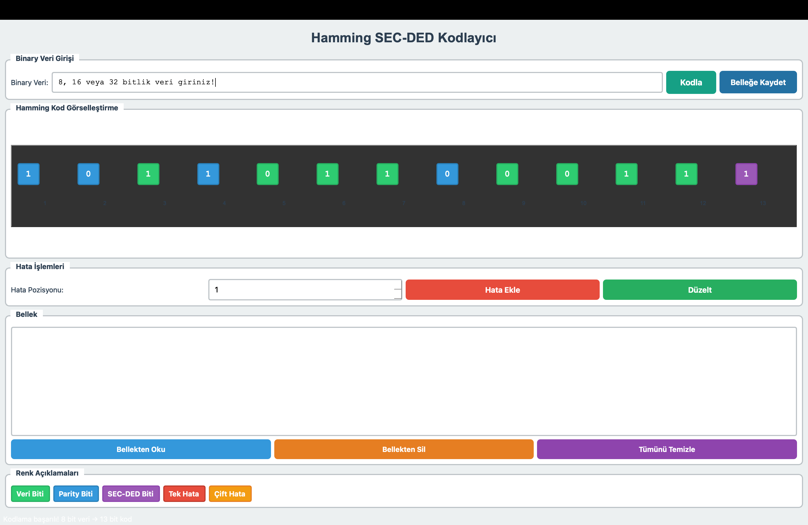
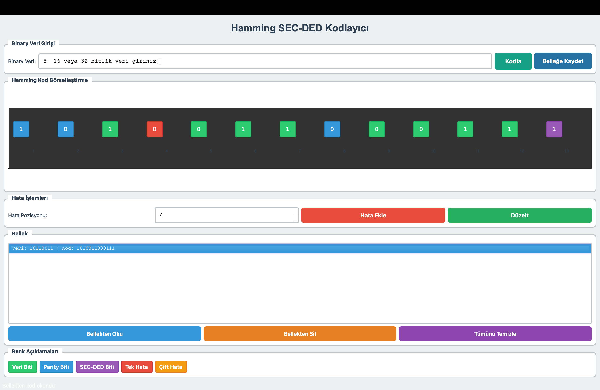
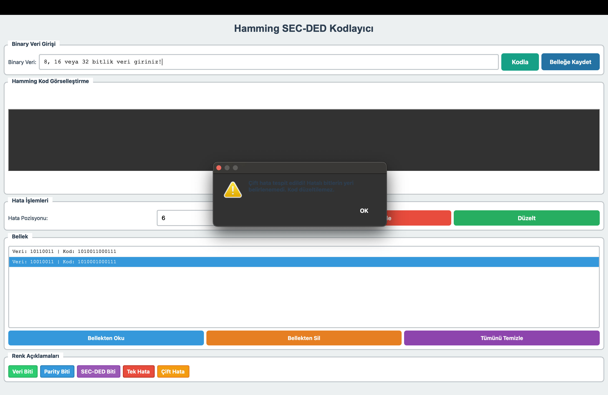

# Hamming SEC-DED Kod Simülatörü (PyQt5)
Bu proje, Hamming Kodunun SEC (Single Error Correction - Tek Hata Düzeltme) ve DED (Double Error Detection - Çift Hata Tespiti) yeteneklerini grafik arayüzle simüle eden bir Python uygulamasıdır. BTÜ BLM230 Bilgisayar Mimarisi dersi dönem projesi kapsamında geliştirilmiştir.

---

## Özellikler

- 8, 16 ve 32 bitlik veri girişi
- SEC (Tek Hata Düzeltme) ve DED (Çift Hata Tespiti)
- PyQt5 ile geliştirilmiş kullanıcı dostu arayüz
- Renkli bit kutucukları: veri/parity/secded/hatalı
- Belleğe yazma, okuma, silme işlemleri
- Sendrom hesaplama ve hata düzeltme
- Gerçek zamanlı görselleştirme
- Klavye kısayolları (Ctrl+C, Ctrl+V, Del, F5)

---

## Gereksinimler

- Python 3.x
- PyQt5

## Ekran Görüntüleri
### Ana Ekran 

### Bellege Kaydet

### Tek Hata

### Cift Hata

## Kullanım Senaryoları
### Kodla
- Geçerli bir 8, 16 veya 32 bitlik binary veri girin ve Kodla butonuna tıklayarak Hamming SEC-DED kodunu üretin. Bitler renkli kutucuklarla görselleştirilir.
### Hata Ekle
- Hata eklemek istediğiniz bit pozisyonunu seçin ve Hata Ekle butonuna tıklayın. Seçilen bit terslenir ve kırmızı (tek hata) veya sarı (çift hata) ile vurgulanır.
### Düzelt
- Düzelt butonuna tıklayarak tek bit hatalarını otomatik olarak düzeltebilirsiniz. Çift hatalar varsa sistem sizi uyarır ancak düzeltme yapmaz.
### Belleğe Kaydet
- Aktif kodu (hatalı veya hatasız) belleğe kaydetmek için Belleğe Kaydet butonuna basın. Kod, “Bellek” listesinin altına eklenir.
### Bellekten Oku
- Bellekten daha önce kaydedilmiş bir kodu yüklemek için listeden çift tıklayın veya Bellekten Oku butonuna basın. Kod yeniden görselleştirilir.
### Bellekten Sil
- Bellekteki bir kodu kaldırmak için listede ilgili satırı seçin ve Bellekten Sil butonuna tıklayın.
### Tümünü Temizle
- Tümünü Temizle butonuna veya Ctrl+N kısayoluna basarak giriş alanı, görselleştirme ve hata işaretlemelerini sıfırlayabilirsiniz.

## Demo Videosu
https://www.youtube.com/watch?v=j0MOhqZ0uog
